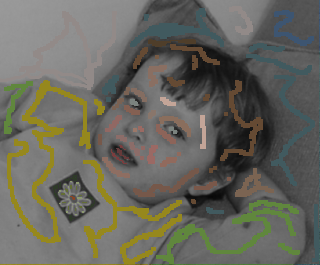

# Colorization Using Optimization

Project of the course Media Computation 2020 Autumn

Paper: [SIGGRAPH 2004 Colorization Using Optimization](https://www.cs.huji.ac.il/~yweiss/Colorization/)

Result:

